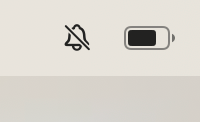
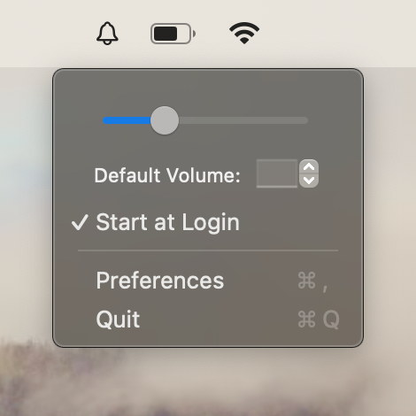
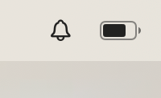

# Swift Alert Control

A simple program written in swift to control the MacOS ringer/alert volume from the menu bar! ✨

<table class="tg">

<thead> 
  <tr>
    <td class="tg-0pky" colspan="2" rowspan="2"></td>
    <td class="tg-0pky" colspan="3" rowspan="4"></td>
  </tr>
  <tr>
  </tr>
  <tr>
    <td class="tg-0pky" colspan="2" rowspan="2"></td>
  </tr>
  <tr>
  </tr>
</thead>
</table>

# About:
Swift Alert Control allows you to control alert volume from the menu bar - just click to mute/unmute, or right click to adjust the volume with a slider.

 State        | Feature           |
| ------------- |:-------------| 
| ✅  | Properly control alert volume |
| ✅  | Revert to previous volume on unmute |
| ✅  | Click icon to mute/unmute |
| ✅  | Rick-click menu with volume slider |
| ✅  | Launch at login |
| ✅  | Volume Slider |
| 🚫      | Preferences Pane     |
| 🚫  | Set Default Volume      |
| 🚫 | Microwave safe |

Default volume intended function: set a default value for when a previous volume level doesn't exist

#
If you particularly appreciate this very alpha-level software, then feel free to support me on Ko-fi!

#
